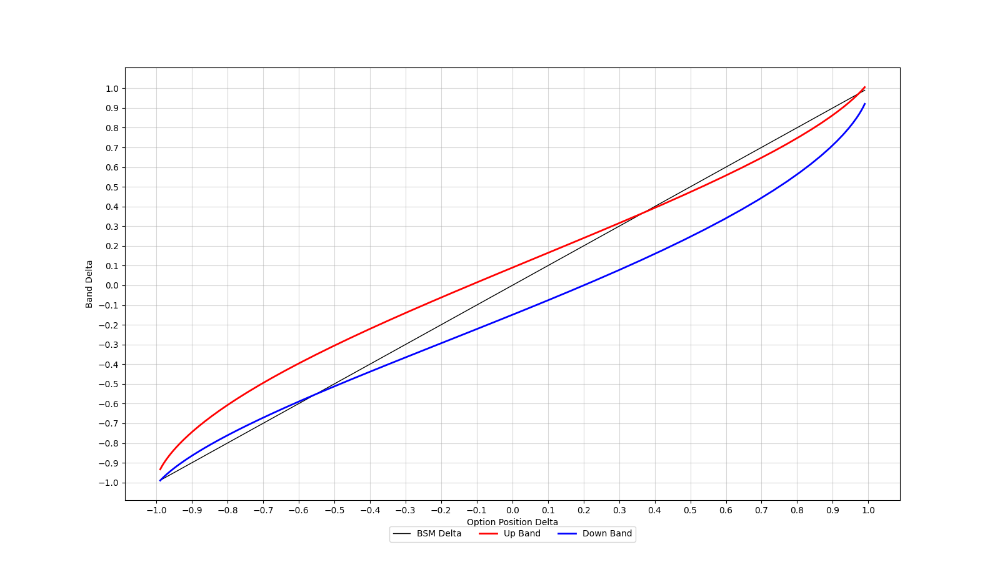

# Zakamouline Optimal Delta Hedging
Implementation of [Optimal Hedging of Options with Transaction Costs](https://www.efmaefm.org/0EFMAMEETINGS/EFMA%20ANNUAL%20MEETINGS/2005-Milan/papers/284-zakamouline_paper.pdf "Optimal Hedging of Options with Transaction Costs") by Valeri. I. Zakamouline.

### Requirements
My other [repo](https://github.com/liamfayle/Black-Scholes-Merton "repo") containing a BSM model implementation.

### References
- [Optimal Hedging of Options with Transaction Costs](https://www.efmaefm.org/0EFMAMEETINGS/EFMA%20ANNUAL%20MEETINGS/2005-Milan/papers/284-zakamouline_paper.pdf "Optimal Hedging of Options with Transaction Costs") by Valeri. I. Zakamouline.
- [Volatility Trading: 2nd Edition](https://www.amazon.com/Volatility-Trading-Website-Euan-Sinclair/dp/1118347137 "Volatility Trading: 2nd Edition") by Euan Sinclair.
- [Optimal Hedging of Options - asymmetry between long and short vol positions](https://quant.stackexchange.com/questions/48603/optimal-hedging-of-options-asymmetry-between-long-and-short-vol-positions)

### Usage
- Obtaining hedgeband values at current spot price.

```python
'''@Init Call & Put
Spot = 100
Strike = 100
DTE = 60
RFR = 5%
Volatility = 30%'''
call = BsmOption(False, 'C', 100, 100, 60, 0.05, sigma=0.3)
put = BsmOption(False, 'P', 100, 100, 60, 0.05, sigma=0.3)

#Init short straddle position
short_straddle = OptionPosition([call, put])

#Get hedgebands at current spot price
'''Position = short_straddle
Proportional transaction cost lambda where (tc = lambda * num_shares * spot) = 2%
Risk aversion parameter (higher results in tighter bands) = 1'''
up_band, down_band = hedgebands(short_straddle, 0.02, 1)
```
- Obtaining hedgebands for range of spot prices.
```python
for i in range (0, 200)
    call = BsmOption(False, 'C', i, 100, 60, 0.05, sigma=0.3)
    put = BsmOption(False, 'P', i, 100, 60, 0.05, sigma=0.3)
    short_straddle = OptionPosition([call, put])
    up_band, down_band = hedgebands(short_straddle, 0.02, 1)
```

### Interpretation


[original upstream author's chart](https://user-images.githubusercontent.com/74878922/205398420-9167d891-339a-4832-9ed0-a82dffeddae8.jpg)


"When our position's delta moves outside the band, we hedge to bring our delta back to the edge of the band." (Sinclair 99)

- If position delta breaches a band, you buy the requisite number of shares to bring delta ***just*** inside closest band. This is referred to as hedging to the band.
    - Eg: In the figure above, if an overnight gap brought your position to Δ = -0.70, you would hedge to the nearest band (down band) at Δ = -0.55 by purchasing 15 shares.

## Testing

"These were for the case of a one-year option with volatility of 0.3, transaction costs of 2 percent, zero interest and carry rates, and a risk aversion of one." (Sinclair 105)

The results from the library look pretty close to the diagrams in Sinclar's Volatility Trading. We do not know the spot price used in the calculation of the long and short calls, and this is used in the calculation of K.

### Long Call


(Sinclair 106)


### Short Call


(Sinclair 106)


